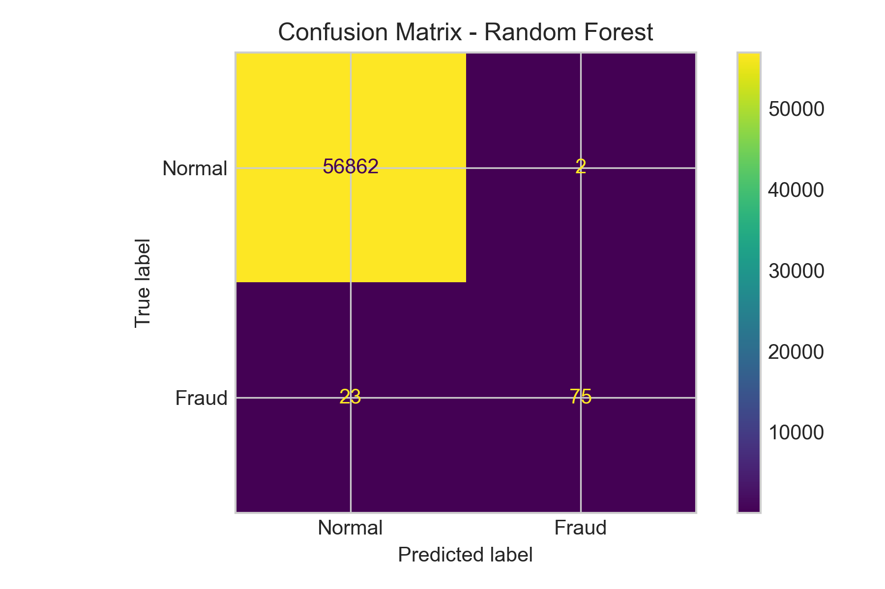
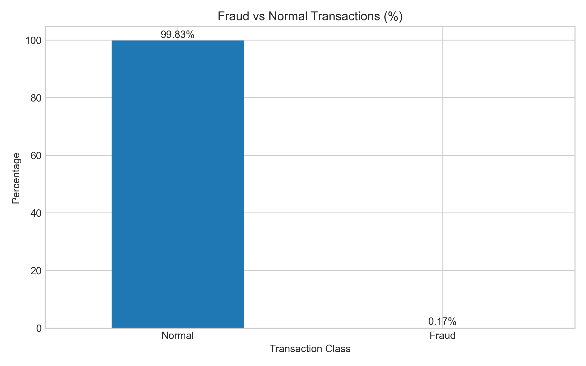
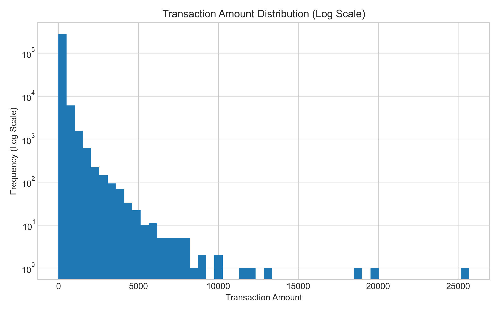
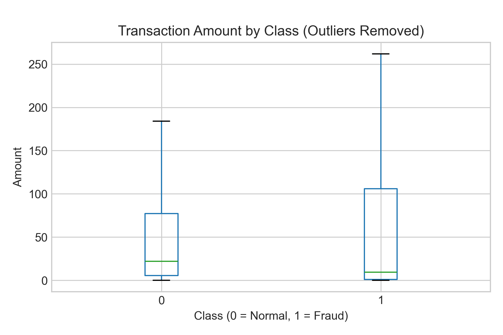

# 🚀 AI Financial Fraud Detection & Risk Scoring System

## 📌 Overview
This project develops a machine learning–based system for detecting fraudulent financial transactions and classifying them into actionable risk levels. It integrates data science, financial analysis, and audit-oriented risk logic to enhance fraud prevention, improve transaction monitoring, and support data-driven financial decision-making.

The system addresses real-world challenges such as extreme class imbalance in financial datasets and demonstrates how AI can improve transparency, strengthen internal controls, and support more resilient financial systems.

---

## 🎯 Key Features
- Fraud detection using machine learning models  
- Comparison of multiple models (Logistic Regression, Balanced Model, Random Forest)  
- Handling of highly imbalanced financial datasets  
- Intelligent risk scoring system (Low, Medium, High)  
- Audit-oriented interpretation engine  
- Rule-based financial risk adjustments  
- Performance evaluation using precision, recall, and F1-score  
- Interactive Streamlit dashboard  

---

## 🖥️ Interactive Streamlit App

This project includes an interactive Streamlit dashboard that allows users to enter transaction details and receive:

- Model fraud probability  
- Adjusted risk score  
- Low / Medium / High risk classification  
- Audit-oriented interpretation  
- Rule-based risk factor explanations  

Run the application locally with:

```bash
streamlit run app.py
```

The dashboard demonstrates how machine learning predictions can be combined with financial risk logic to support fraud detection and transaction monitoring.

---

## 📊 Final Model Performance (Random Forest)

- Precision: **0.97**  
- Recall: **0.77**  
- F1-score: **0.86**  

The model achieves a strong balance between detecting fraudulent transactions and minimizing false positives, which is critical in financial systems.

---

## 📊 Visual Insights

### Confusion Matrix


### Fraud Distribution (%)


### Transaction Distribution (Log Scale)


### Transaction Amount by Class (Outliers Removed)


---

## 🧠 Key Insight

Fraud detection is not just about accuracy. Due to severe class imbalance in financial datasets, models must balance:

- Detecting fraudulent transactions (**recall**)  
- Avoiding false alarms (**precision**)  

This project highlights the importance of probability-based decision-making, threshold tuning, and audit-oriented risk interpretation in real-world fraud detection systems.

---

## 🛠️ Technologies Used

- Python  
- Pandas  
- Scikit-learn  
- Matplotlib  
- Streamlit  

---

## 📁 Project Structure

```text
AI-Financial-Fraud-Risk-Detection/
│
├── app.py                              # Streamlit dashboard
├── fraud_detection.py                  # Main ML pipeline
├── README.md                           # Project documentation
├── .gitignore                          # Ignore large files
├── Screenshots/                        # Visual outputs
├── Outputs/                            # Prediction outputs
└── data/                               # Dataset (not uploaded)
```

---

## ▶️ How to Run

### 1. Clone the repository

```bash
git clone https://github.com/ttaanisa/AI-Financial-Fraud-Risk-Detection.git
```

### 2. Navigate into the project

```bash
cd AI-Financial-Fraud-Risk-Detection
```

### 3. Install dependencies

```bash
pip install pandas scikit-learn matplotlib streamlit
```

### 4. Run the fraud detection pipeline

```bash
python fraud_detection.py
```

### 5. Launch the interactive dashboard

```bash
streamlit run app.py
```

---

## 📌 Note on Dataset

The dataset is not included due to GitHub file size limitations.

Download it from:

https://www.kaggle.com/datasets/mlg-ulb/creditcardfraud

Then place it in:

```text
data/creditcard.csv
```

---

## 💡 Future Improvements

- Real-time fraud detection system (live transaction scoring)  
- Deployment using Streamlit Cloud or FastAPI  
- Enterprise fraud monitoring dashboard  
- Integration with financial transaction systems  
- Advanced models (XGBoost, Neural Networks)  
- Explainable AI techniques (SHAP, LIME)  
- Automated anomaly alerting system  
- API integration for financial platforms  

---

## 🚀 Project Vision

This project serves as a foundation for building intelligent financial risk systems capable of supporting banks, fintech platforms, auditors, and regulatory environments in detecting fraud more proactively and efficiently.

The long-term vision is to combine artificial intelligence, financial analytics, and audit-oriented decision logic to improve fraud detection transparency and strengthen financial system resilience.

---

## 👤 Author

**Takudzwa Taanisa**  
Master’s in Global Management (Data Science)  
Arizona State University
